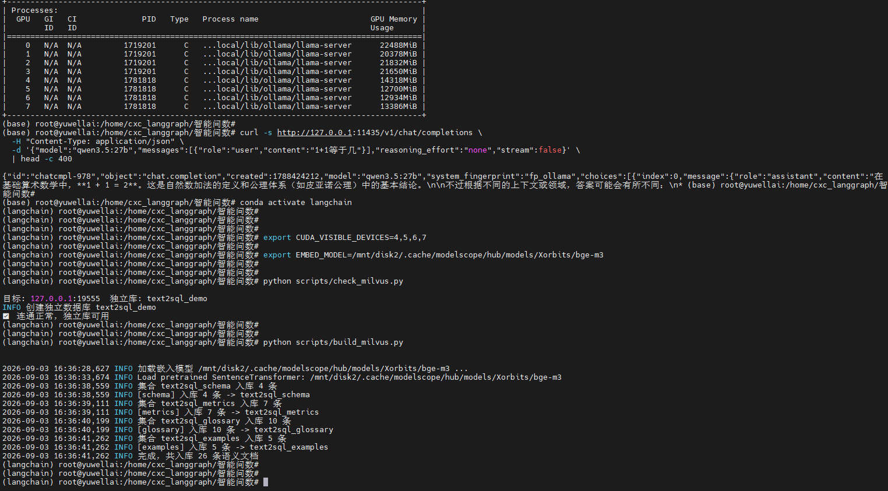

# 智能问数系统 · NL2SQL Text-to-SQL Agent


> 用自然语言问业务数据，系统自动「检索业务语义 → 生成 SQL → 六道防线校验 → 只读执行 → 关键数字直出」，从根上杜绝 LLM 编数字。
>
> *A retrieval-augmented Text-to-SQL agent: natural language in, auditable SQL-backed numbers out — built for accuracy over flash.*

---

## 这个项目解决什么问题

让 LLM 直接回答"本月血压计销量多少"时，最大的坑是**编数字**——模型凭记忆瞎报一个数，或现场心算算错。常见的 Dify / Coze 工作流本质是"接口取数 → 丢给 LLM 总结"，数字不可审计、口径不可追溯。

本项目走另一条路：

- **LLM 只负责"理解问题 + 写 SQL"**，数字永远由 SQL 在真实数据上执行得出；
- 用**六道防线**把"SQL 写错"的概率压到最低；
- 最终答案里的数字/表格 **100% 由 SQL 结果格式化而来**，LLM 只做可选解读。

结果是：一个**数据准确率优先、可交互、可审计**的 RAG + Agent 完整方案，敢在真实环境里跑。

---

## 核心亮点

1. **多源数据融合**：6 个长相各异的电商日报接口（天猫/京东/拼多多 × 品类/店铺）归一化到一张统一事实表 `daily_metrics`，Agent 永远只面对一张表。
2. **语义层 + 混合检索**：schema / 指标口径 / 业务术语 / few-shot 样例四类语义资产入 Milvus 独立库，dense 语义 + BM25 全文混合检索（RRF 融合）。
3. **六道防线防 SQL 写错**：物化指标 → 口径固化 → 静态白名单 → EXPLAIN 预演 → 结果合理性检查 → 自修复 + 人审。
4. **关键数字直出**：最终答案里的数字/表格 100% 由 SQL 结果格式化而来，LLM 只做可选解读，从根上杜绝"编数字"。
5. **资源物理隔离**：独立 Ollama 实例占用空闲 GPU、独立端口、独立模型目录，与已有推理服务零影响。
6. **全链路离线可测**：依赖注入 + mock 数据 + 假 LLM，无 GPU / Milvus 的本机也能整图跑通 90% 自研逻辑。

---

## 效果演示

> 替换为你自己的一次真实问答截图或 GIF（如：提问"天猫血压计本月进度是多少？" → 返回表格 + 关键数字）。截图放到 `assets/demo.png`。



---

## 系统架构

```
┌──────────────┐   自然语言    ┌───────────────────────────────────────────┐
│  Streamlit UI │ ───────────▶ │  FastAPI  /chat  /sql  /health           │
│  (问数界面)   │              │         │ invoke                         │
└──────────────┘              │         ▼                                │
                              │  LangGraph 状态图                          │
                              │  retrieve→generate→validate→execute→answer │
                              │       │          ▲ 修复回边(repair)         │
                              │       ▼                                   │
                              │  语义检索(Milvus 独立库)   SQLite(只读)      │
                              │  schema/metrics/glossary/examples          │
                              └──────────────┬────────────┬───────────────┘
                                             │            │
                                     Milvus 2.6       Ollama(本地量化 LLM)
                                     text2sql_demo    独立实例(GPU 隔离)
```

**分层**：`etl/`（数据接入）→ `semantic/` + `src/milvus_store`（语义资产）→ `src/agent`（LangGraph 编排）→ `src/formatter` + `src/presenter`（可信输出）→ `src/api` / `src/ui`（服务与界面）。

---

## 技术栈

| 层 | 技术 |
|---|---|
| Agent 编排 | LangGraph（状态图 + 条件边 + 自修复回路） |
| LLM | Ollama 本地量化模型（Qwen3.5-27B，OpenAI 兼容端点） |
| 语义检索 | Milvus 2.6（独立库）+ bge-m3（1024 维）+ BM25（RRF 融合） |
| 数据 | SQLite（只读）+ 多源 ETL 归一化 |
| 服务 | FastAPI + Uvicorn |
| 界面 | Streamlit |
| 评测 | 自研 gold_set + 归一化指标 |

---

## 目录结构

```
ecommerce-daily-qa/
├── config/            # datasources.yaml / llm.yaml / milvus.yaml（配置契约）
├── etl/               # 多源融合：schema.py / mock_data.py / sync.py
├── semantic/          # 语义资产：metrics.yaml / glossary.yaml / examples.json
├── src/
│   ├── sql_validator.py  # 防线③静态白名单
│   ├── db.py             # 只读执行 + EXPLAIN 预演
│   ├── result_check.py   # 防线⑤结果合理性检查
│   ├── formatter.py      # 关键数字直出
│   ├── presenter.py      # 审计轨迹
│   ├── llm.py            # Ollama 客户端（独立实例）
│   ├── embed.py          # bge-m3 嵌入（懒加载 torch）
│   ├── milvus_store.py   # Milvus 独立库 + BM25 混合检索
│   ├── retriever.py      # 四类语义上下文拼装
│   ├── agent/            # LangGraph：state/prompts/nodes/graph
│   ├── api/server.py     # FastAPI
│   └── ui/app.py         # Streamlit
├── eval/              # 评测：gold_set.json / run_eval.py
├── scripts/           # build_milvus / check_milvus / run_api / run_ui / 部署脚本
├── verify_day{1..8}.py   # 逐日离线验证（本机可跑）
└── docs/              # 逐日技术实现详解（面向入门开发者，按调用链路）
```

---

## 快速开始

### 方式 A：本机离线 Demo（无 GPU / Milvus，10 分钟跑通）

```bash
# 0. 装依赖（离线 demo 无需 torch，跳过 GPU 依赖也能跑逻辑）
pip install -r requirements.txt

# 1. 生成 mock 数据到 SQLite
python -m etl.sync

# 2. 整图离线验证（假 LLM / 假检索器 / 真 SQLite）
python verify_day3.py         # 3/3 场景（LangGraph 编排）
python verify_day4.py         # 4/4 场景（四道防线）
python verify_day5.py         # 5/5 场景（数字直出）
python verify_day8.py         # 评测 harness 自检

# 3. Streamlit 界面预览（侧边栏开「Demo 模式」）
streamlit run src/ui/app.py
```

### 方式 B：完整部署（GPU + Milvus + Ollama）

```bash
# 0. 依赖（torch 按你的 CUDA 版本选对应 wheel）
pip install -r requirements.txt
pip install torch --index-url https://download.pytorch.org/whl/cu121   # 示例：CUDA 12.x

# 1. 起独立 Ollama 实例（空闲 GPU + 独立端口 + 独立模型目录，与已有服务隔离）
source scripts/setup_env.sh          # 设 CUDA_VISIBLE_DEVICES + EMBED_MODEL
bash scripts/start_ollama_isolated.sh
ollama pull qwen3.5:27b              # 或你环境里任意 OpenAI 兼容模型

# 2. 语义资产入 Milvus 独立库 text2sql_demo
python scripts/check_milvus.py      # 连通性自检
python scripts/build_milvus.py      # 建 4 集合 + 入库

# 3. 起服务
python scripts/run_api.py           # FastAPI :8000
python scripts/run_ui.py            # Streamlit :8501
```

> Milvus 的 host/port、Ollama 的 base_url/model 都在 `config/*.yaml` 里配置，部署时按你的环境改一处即可。

---

## 六道防线（为什么敢说"数据准确"）

| 防线 | 落点 | 抓什么 |
|------|------|--------|
| ① 物化指标 | ETL | 月/年进度提前算好存字段，LLM 禁止现场除 |
| ② 口径固化 | semantic | 口径由人定，LLM 只引用不发明 |
| ③ 静态白名单 | validate | 多语句 / DDL / 越权表 |
| ④ EXPLAIN 预演 | validate | 不存在的列等编译级错误 |
| ⑤ 结果合理性检查 | execute | 列缺失 / 空结果 / NaN / 触顶 |
| ⑥ 自修复 + 人审 | graph + answer | 失败重生成 ≤2 次；低置信度提示人工核对 |

> 前两道在数据侧（ETL + 语义层）把坑堵在源头，后四道在执行侧（校验 + 执行 + 编排）兜底。对比 Dify 工作流（接口取数 → 给 LLM 一段话总结）：Dify 是"固定报表生成器"，数字是 LLM 编的、不可审计；本方案是"可交互查询引擎"，SQL 可审、数字直出、口径可追溯。

---

## 评测

```bash
python eval/run_eval.py                  # mock 后端：脚本化 LLM 回填 gold SQL（harness 自检，应 100%）
python eval/run_eval.py --backend ollama # 真 LLM：测真实生成准确率
```

指标：SQL 结构一致率 / 执行成功率 / 结果非空率 / 平均修复次数。

---

## License

[MIT](./LICENSE)
